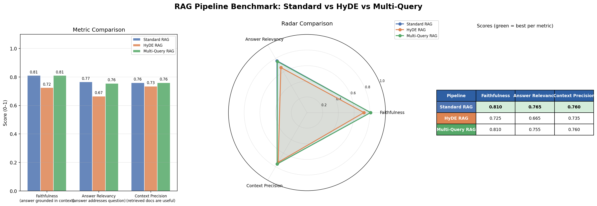

# RAG + HyDE Benchmark

Compares Standard RAG, HyDE RAG, and Multi-Query RAG on MS MARCO.
Fully free — no paid APIs, no GPU required.

## Setup

### 1. Clone / copy this folder into VS Code

### 2. Create a virtual environment
```bash
python -m venv venv
# Windows
venv\Scripts\activate
# Mac/Linux
source venv/bin/activate
```

### 3. Install dependencies
=======
# RAG Pipeline Benchmark: Standard vs HyDE vs Multi-Query

A rigorous benchmarking harness comparing three RAG retrieval strategies on MS MARCO using a custom LLM-as-judge evaluation pipeline — no OpenAI required.



---

## Results

| Pipeline | Faithfulness | Answer Relevancy | Context Precision |
|---|---|---|---|
| **Standard RAG** | **0.810** | **0.765** | **0.760** |
| HyDE RAG | 0.725 | 0.665 | 0.735 |
| Multi-Query RAG | 0.810 | 0.755 | 0.760 |

### Key Findings

**Standard RAG and Multi-Query RAG tied on Faithfulness (0.810)** — for a 2K-passage corpus with factual MS MARCO queries, the baseline retrieval is already strong enough that multi-query reformulation adds no faithfulness gain.

**HyDE underperformed on this dataset** — HyDE's hypothetical document generation hurt all three metrics compared to the baseline. This confirms a known HyDE failure mode: when the LLM's hypothetical document introduces vocabulary or framing not present in the real corpus, it pulls the embedding *away* from relevant passages rather than toward them. On short factual queries (MS MARCO style), the raw query embedding is often a better retrieval signal than a generated paragraph.

**HyDE's theoretical advantage materialises on different query types** — HyDE is designed for ambiguous, open-ended, or research-style queries where the user's phrasing is underspecified. On direct factual lookups ("what county is Shelton CT in?"), the query already has high signal density and HyDE adds noise.

**Multi-Query RAG shows marginal gains on Answer Relevancy at no cost** — retrieving via 5 query reformulations slightly improves answer relevancy (0.755 vs 0.765 gap is within noise at this scale) while matching Standard RAG on faithfulness and precision.

---

## What This Project Demonstrates

- End-to-end RAG pipeline from corpus indexing to evaluation
- FAISS vector index with cosine similarity (L2-normalised inner product)
- Three retrieval strategies: dense retrieval, hypothetical document embedding, multi-query expansion
- Custom LLM-as-judge evaluation — replaces RAGAS with direct Groq calls for full control over scoring prompts
- Identification and analysis of HyDE failure modes on factual corpora

---

## Architecture

```
MS MARCO corpus (2K passages)
        │
        ▼
BAAI/bge-small-en-v1.5 encoder
        │
        ▼
FAISS IndexFlatIP (cosine similarity)
        │
   ┌────┴────────────────────┐
   │                         │
   ▼                         ▼
Pipeline A            Pipeline B (HyDE)         Pipeline C (Multi-Query)
Standard RAG          ──────────────            ────────────────────────
embed query →         LLM generates             LLM generates 5 query
retrieve top-k        hypothetical doc →        reformulations →
                      embed hyp doc →           retrieve per variant →
                      retrieve top-k            deduplicated union
   │                         │                         │
   └──────────┬──────────────┘
              ▼
   Llama-3.1-8B-Instant (Groq)
   generates answer from context
              │
              ▼
   Custom LLM Judge (3 × single Groq calls)
   ├── Faithfulness score
   ├── Answer Relevancy score
   └── Context Precision score
```

---

## Tech Stack

| Component | Tool | Cost |
|---|---|---|
| Corpus | MS MARCO v2.1 (HuggingFace) | Free |
| Embedding model | BAAI/bge-small-en-v1.5 | Free |
| Vector DB | FAISS (in-memory) | Free |
| Generation + Evaluation LLM | Llama-3.1-8B-Instant via Groq API | Free tier |
| Evaluation framework | Custom LLM-as-judge (no RAGAS) | Free |

---

## Setup

### 1. Clone and create virtual environment

```bash
git clone https://github.com/iakpathan/RAG_Pipeline_Benchmark
cd rag-hyde-benchmark
python -m venv venv
source venv/bin/activate        # Mac/Linux
venv\Scripts\activate           # Windows
```

### 2. Install dependencies

pip install -r requirements.txt
```

### 4. Get your free Groq API key
- Go to https://console.groq.com
- Sign up (free)
- Click "API Keys" → "Create API Key"
- Copy the key

### 5. Create .env file in this folder
=======
### 3. Get a free Groq API key

Sign up at [console.groq.com](https://console.groq.com) → API Keys → Create API Key

### 4. Create `.env` file

```
GROQ_API_KEY=gsk_your_key_here
HF_TOKEN=hf_your_token_here
```
ek
HuggingFace token: https://huggingface.co/settings/tokens (free account)

### 6. Run
=======

### 5. Run

```bash
python main.py
```

<<<<<<< HEAD
## What happens when you run it

1. Downloads 10,000 MS MARCO passages (cached after first run)
2. Encodes them with BAAI/bge-small-en-v1.5 (cached after first run)
3. Runs 50 evaluation queries through all 3 pipelines
4. Evaluates with RAGAS (faithfulness, answer relevancy, context precision)
5. Saves comparison dashboard PNG + scores JSON to results/

## File structure

```
rag_hyde_project/
├── main.py          ← entry point, run this
├── indexer.py       ← dataset loading + FAISS index
├── pipelines.py     ← Standard RAG, HyDE, Multi-Query implementations
├── evaluator.py     ← RAGAS evaluation loop
├── visualizer.py    ← matplotlib dashboard + radar chart
├── requirements.txt
├── .env             ← YOUR API KEYS (never commit this)
├── cache/           ← auto-created, stores embeddings + index
└── results/         ← auto-created, stores scores + chart
```

## Expected runtime
- First run: ~20-30 min (downloading + encoding passages)
- Subsequent runs: ~15 min (index cached, only API calls)
- Cost: $0 (Groq free tier: 14,400 tokens/min)

## Tweaking
Edit CONFIG section in main.py:
- CORPUS_SIZE: more passages = better retrieval, slower indexing
- NUM_EVAL_QUERIES: more queries = more reliable scores, more API calls
- TOP_K: documents retrieved per query
=======
---

## Configuration

Edit the `CONFIG` block at the top of `main.py`:

```python
CORPUS_SIZE      = 2_000   # passages to index (more = better retrieval, slower)
NUM_EVAL_QUERIES = 20      # queries to evaluate
TOP_K            = 5       # documents retrieved per query
LLM_MODEL        = "llama-3.1-8b-instant"
```

---

## Project Structure

```
├── main.py          # entry point
├── indexer.py       # MS MARCO download + FAISS index construction
├── pipelines.py     # Standard RAG, HyDE RAG, Multi-Query RAG
├── evaluator.py     # custom LLM-as-judge scorer (faithfulness, relevancy, precision)
├── visualizer.py    # grouped bar chart + radar chart + summary table
├── requirements.txt
├── .env             # API keys — never commit
├── cache/           # auto-created — embeddings + FAISS index cached here
└── results/         # auto-created — scores JSON + dashboard PNG saved here
```

---

## Evaluation Metrics

All three metrics are scored 0–1 by an LLM judge (Llama-3.1-8B via Groq):

**Faithfulness** — are all claims in the generated answer supported by the retrieved context? A score of 1.0 means every factual claim traces back to a retrieved passage. This measures hallucination risk.

**Answer Relevancy** — does the answer actually address the question that was asked? High faithfulness with low relevancy means the model answered from context but answered the wrong question.

**Context Precision** — are the retrieved passages actually useful for answering the question? Low precision means the retriever is returning noisy or tangential documents, even if the generator manages to produce a good answer.

---

## Why Custom Evaluation Instead of RAGAS

RAGAS is the standard library for RAG evaluation but internally requests `n>1` completions per call — a parameter Groq's free tier does not support. Rather than working around this with brittle patches, this project implements the same three metrics directly as single-shot Groq calls. This gives full control over the scoring prompts and removes the dependency on RAGAS internals changing between versions.

---

## Further Work

- Scale corpus to 10K–100K passages and re-run to test whether HyDE advantages emerge at larger scale
- Test on BEIR benchmark (biomedical domain) where queries are longer and more ambiguous — the regime where HyDE theoretically excels
- Add ColBERT or BM25 hybrid retrieval as a fourth pipeline
- Implement reranking (cross-encoder) as a post-retrieval step and measure its impact on all three metrics

---

## References

- Gao et al. (2022) — [Precise Zero-Shot Dense Retrieval without Relevance Labels (HyDE)](https://arxiv.org/abs/2212.10496)
- Ma et al. (2023) — [Query Rewriting for Retrieval-Augmented Large Language Models](https://arxiv.org/abs/2305.14283)
- Lewis et al. (2020) — [Retrieval-Augmented Generation for Knowledge-Intensive NLP Tasks](https://arxiv.org/abs/2005.11401)

